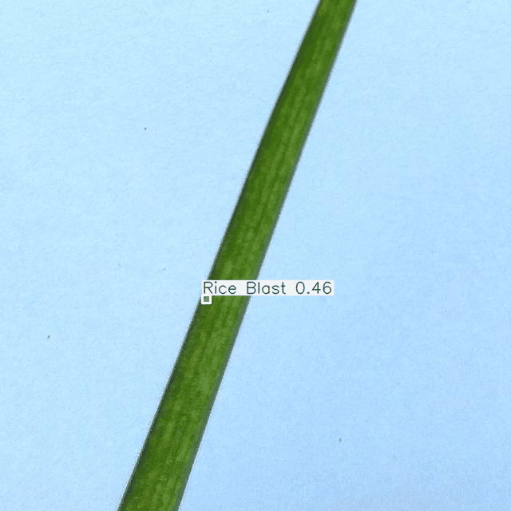
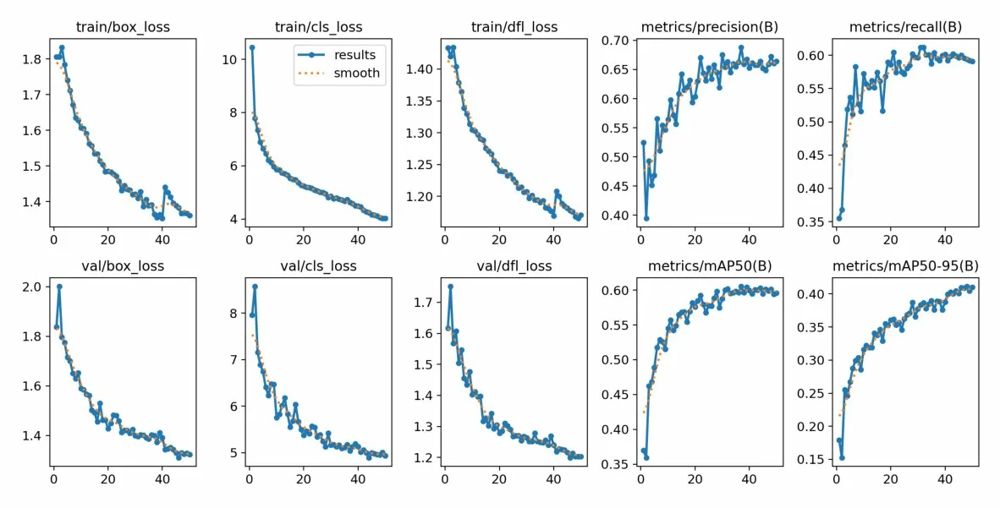
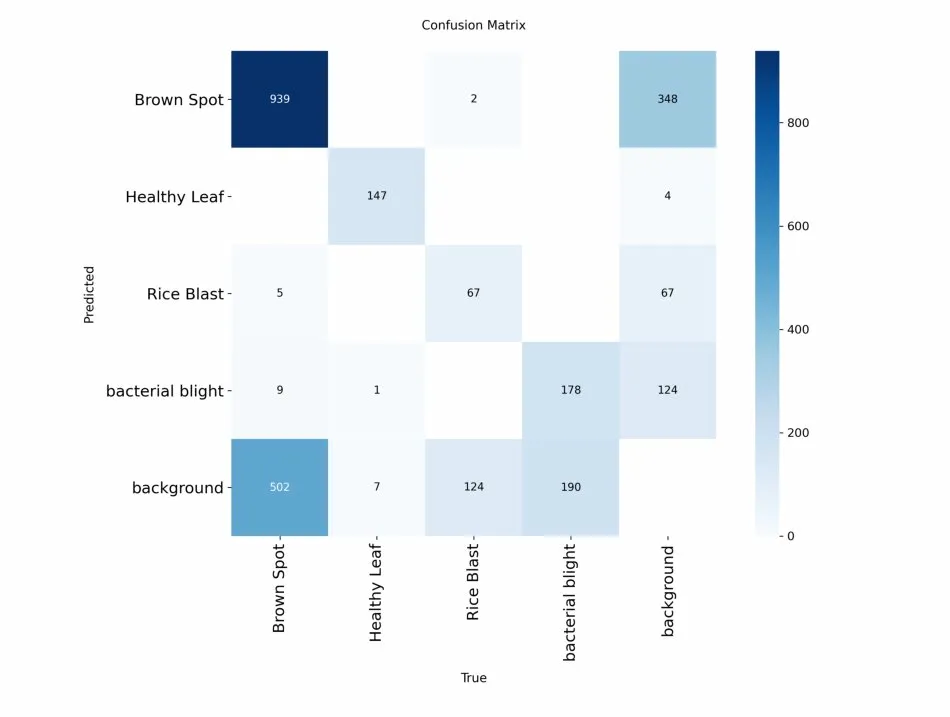

# 🌾 Rice Disease Detection using YOLOv8

## Demo

## Problem Statement
Rice is one of India's most critical crops. Diseases like Bacterial 
Leaf Blight, Brown Spot, and Rice Blast can devastate yields if not 
caught early. This project builds a real-time detection system using 
YOLOv8 to localize and classify disease regions on rice leaves.

## Dataset
- Source: Roboflow — Rice Plant Disease Detection
- 3,000 images across 4 classes
- Format: YOLOv8 (normalized bounding boxes)

| Class | mAP50 |
|-------|-------|
| Healthy Leaf | 0.981 |
| Brown Spot | 0.683 |
| Bacterial Blight | 0.431 |
| Rice Blast | 0.311 |
| **Overall** | **0.602** |

## Training
- Model: YOLOv8n pretrained on COCO
- Epochs: 50
- Image size: 640x640
- Hardware: Google Colab T4 GPU

## Training Curves

## Confusion Matrix

## How to Run

### Install dependencies
pip install -r requirements.txt

### Run inference
python src/predict.py --source your_image.jpg --weights best.pt --conf 0.40 --save

## Model Weights
Download best.pt

## What I Learned
- YOLOv8 uses normalized coordinates (0-1) making the model 
  resolution agnostic and augmentation-friendly
- Including a Healthy class is critical — without it the model 
  has no concept of normal and hallucinates detections
- DFL loss models box edges as probability distributions, which 
  helps with disease lesions that have ambiguous boundaries
- The confusion matrix revealed a data problem not a model problem —
  Brown Spot heavily bled into background due to annotation ambiguity
- Domain knowledge matters for threshold selection — in agriculture 
  false negatives (missing disease) are worse than false positives,
  so a lower threshold of 0.40 is appropriate
- opencv-python-headless is the correct choice for server/container 
  environments that have no display